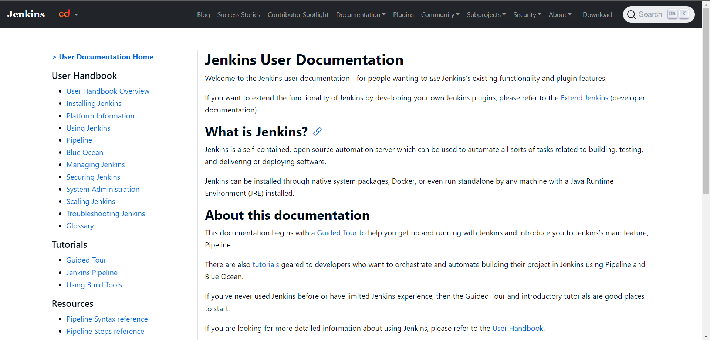
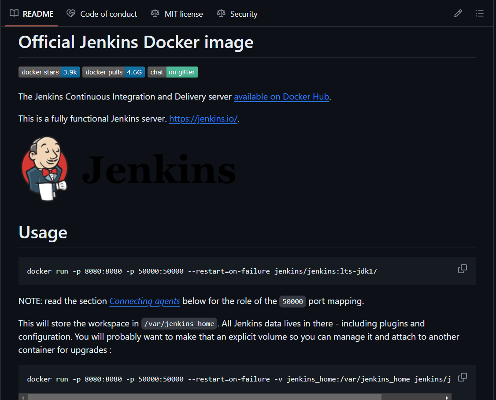
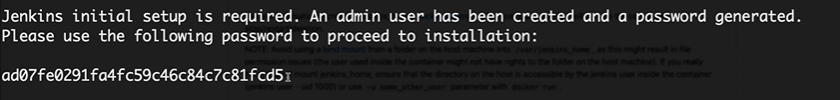
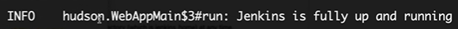
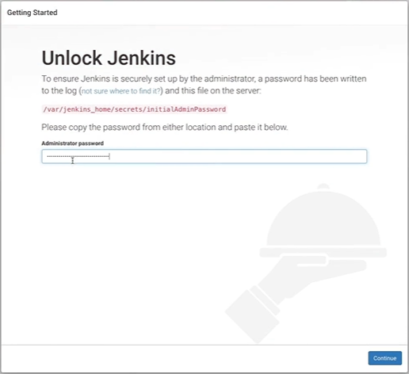
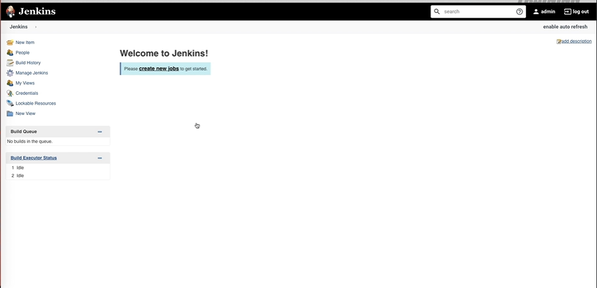

<br/>
<p align="center">
  <a href="https://www.jenkins.io/images/logos/jenkins/jenkins.png">
    
  </a>

  <h3 align="center">Jenkins Code Repo</h3>

  <p align="center">
    How to create a CI/CD Pipeline using Jenkins. Scripts using Important Jenkins features such as Multi branch pipeline, Parameterized pipelines, variables etc
    <br/>
    Note This Project Is Still W.I.P
    <br/>
    <br/>
    <a href="https://github.com/farihanoor/Jenkins/README">Explore the docs</a>
    .
    <a href="https://github.com/farihanoor/Jenkins/issues">Report Bug</a>
    .
    <a href="https://github.com/farihanoor/Jenkins/issues">Request Feature</a>

  </p>
</p>

    [](https://discord.gg/6Kf422a)

## Table Of Contents

- [Table Of Contents](#table-of-contents)
- [About The Project](#about-the-project)
- [Built With](#built-with)
- [Getting Started](#getting-started)
  - [Prerequisites](#prerequisites)
  - [Installation](#installation)
- [Usage](#usage)
- [Roadmap](#roadmap)
- [Contributing](#contributing)
  - [Creating A Pull Request](#creating-a-pull-request)
- [Authors](#authors)

## About The Project



I wanted to create a Jenkins Repo with all the important scripts and notes. Jenkins is an open-source solution comprising an automation server to enable continuous integration and continuous delivery (CI/CD), automating the various stages of software development such as test, build, and deployment.

Features of Jenkins:

- **Deploying code into production:** If all of the tests developed for a feature or release branch are green, Jenkins may automatically publish code to staging or production. This is often referred to as continuous deployment. Changes are done before a merging action can also be seen. One may do this in a dynamic staging environment. Then it’s distributed to a central staging system, a pre-production system, or even a production environment when combined.
- **Enabling task automation:** Another instance in which one may use Jenkins is to automate workflows and tasks. If a developer is working on several environments, they will need to install or upgrade an item on each of them. If the installation or update requires more than 100 steps to complete, it will be error-prone to do it manually. Instead, we can write down all the steps needed to complete the activity in Jenkins. It will take less time, and you can complete the installation or update without difficulty.
- **Reducing the time it takes to review a code:** Jenkins is a CI system that may communicate with other DevOps tools and notify users when a merge request is ready to merge. This is typically the case when all tests have been passed and all other conditions have been satisfied. Furthermore, the merging request may indicate the difference in code coverage. Jenkins cuts the time it takes to examine a merge request in half. The number of lines of code in a component and how many of them are executed determines code coverage. Jenkins supports a transparent development process among team members by reducing the time it takes to review a code.
- **Driving continuous integration:** Before a change to the software can be released, it must go through a series of complex processes. The Jenkins pipeline enables the interconnection of many events and tasks in a sequence to drive continuous integration. It has a collection of plugins that make integrating and implementing continuous integration and delivery pipelines a breeze. A Jenkins pipeline’s main feature is that each assignment or job relies on another task or job.

## Built With

Jenkins features a **Groovy script console** which allows to run Groovy scripts within the Jenkins controller runtime or in the runtime on agents.

- [Groovy ](https://www.jenkins.io/doc/book/managing/script-console/)

## Getting Started

This is an example of how you may give instructions on setting up your project locally.
To get a local copy up and running follow these simple example steps.

### Prerequisites

1.  **Docker Desktop**: We need Docker as a platform to install Jenkins. 2 benefits of using Docker:\
    a. This gives us a standard platform regardless of what operating system we're running on.\
    b. It speeds up the installation process enormously
2.  **VSCode**
3.  VSCode extension - **Groovy Lint, Format and Fix**

### Installation


We'll be following installation instructions from https://github.com/jenkinsci/docker

1. Run the Docker Container. We'll be connecting on port 8080 . 50000 port will be used internally. The following commad will also create a volumn on our local machine, it will store all the information for Jenkins. If our container stops, we can rerun this using this commad and we'll have all our information saved.

```sh
docker run -p 8080:8080 -p 50000:50000 --restart=on-failure -v jenkins_home:/var/jenkins_home jenkins/jenkins:lts-jdk17
```

2. This is the Key to login. Copy it and store it somewhere safe.\
   

3. Looks like Jenkins is running\
   \
   Let's go to http://localhost:8080/

4. Login using the key we saved earlier\
   
5. This is the Jenkins homepage, we can create pipeline from here\
   

## Usage

There are multiple Jenkins file ranging from cleanup jobs, variables, functions, if statement, passing parameters between jobs, job from a job, parameters like Boolean, Choice, Input etc

## Roadmap

See the [open issues](https://github.com/farihanoor/Jenkins/issues) for a list of proposed features (and known issues).

## Contributing

Contributions are what make the open source community such an amazing place to be learn, inspire, and create. Any contributions you make are **greatly appreciated**.

- If you have suggestions for adding or removing projects, feel free to [open an issue](https://github.com/farihanoor/Jenkins/issues/new) to discuss it, or directly create a pull request.
- Please make sure you check your spelling and grammar.
- Create individual PR for each suggestion.

### Creating A Pull Request

1. Fork the Project
2. Create your Feature Branch (`git checkout -b feature/AmazingFeature`)
3. Commit your Changes (`git commit -m 'Add some AmazingFeature'`)
4. Push to the Branch (`git push origin feature/AmazingFeature`)
5. Open a Pull Request

## Authors

- **Fariha Noor** - Cloud Engineer - [Fariha Noor](https://farihanoor.com/) - _All Work_